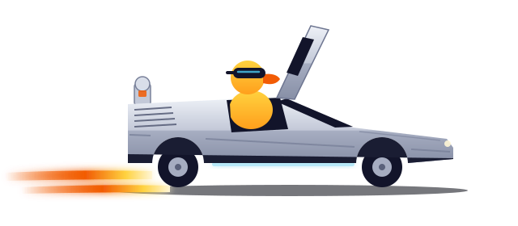
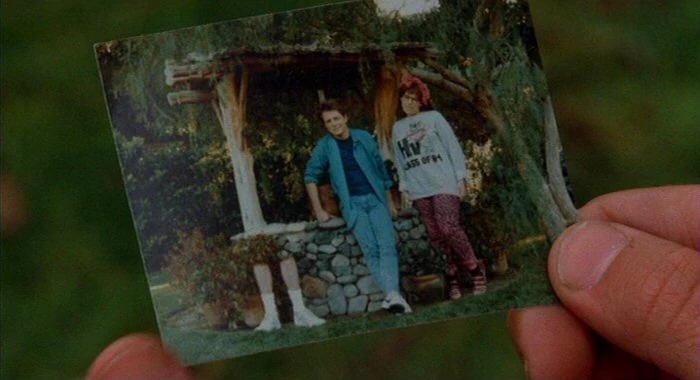
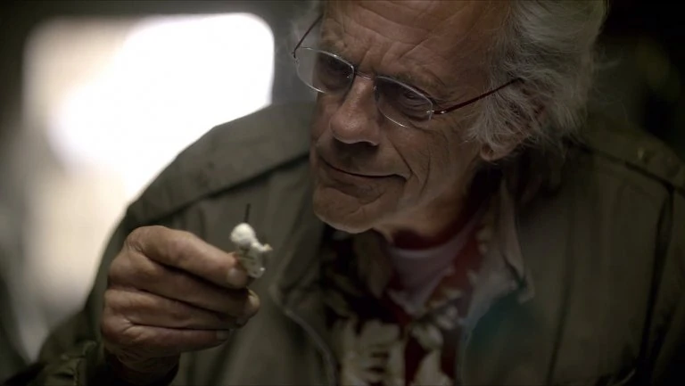
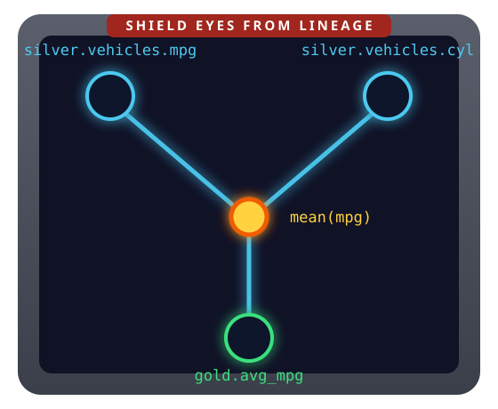
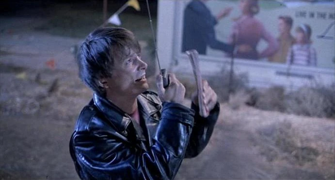
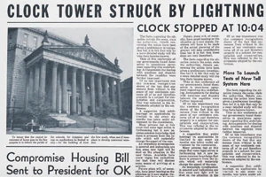

---
format:
  revealjs:
    theme: custom.scss
    width: 1280
    height: 720
    margin: 0.08
    transition: fade
    transition-speed: fast
    highlight-style: dracula
    slide-number: c/t
    hash: true
    menu: false
    code-line-numbers: false
    fig-align: center
    include-after-body: fitview.html
execute:
  echo: true
  warning: false
  message: false
---

```{r}
#| include: false
library(ducklake)
library(dplyr)
library(dplyneage)

# fresh lake every render so snapshot numbers on slides stay true
unlink("data/lake", recursive = TRUE)
dir.create("data/lake", recursive = TRUE, showWarnings = FALSE)

# mtcars carries the car names as row names, an R-only feature that no database
# or Parquet file keeps, so a plain write would drop them. Moving them into a
# `model` column changes no values and loses nothing; it makes the data
# representable as a table, and later slides key on `model` (Biff's
# rows_delete(), the change feed). Done here so the load slide shows mtcars
# going into bronze untouched, which is the point of that slide.
mtcars <- mtcars |> tibble::rownames_to_column("model")

# colors mirror custom.scss so ggplot output sits flush on the slide background
theme_bttf <- ggplot2::theme(
  text = ggplot2::element_text(color = "#e8eaf2", size = 16),
  plot.title = ggplot2::element_text(color = "#e8eaf2", face = "bold", size = 18),
  plot.subtitle = ggplot2::element_text(color = "#8a90ad", size = 13),
  axis.text = ggplot2::element_text(color = "#8a90ad", size = 12),
  axis.title = ggplot2::element_text(color = "#8a90ad", size = 13),
  legend.title = ggplot2::element_text(color = "#e8eaf2"),
  legend.text = ggplot2::element_text(color = "#c0c5ce"),
  panel.grid.major = ggplot2::element_line(color = "#262b47"),
  panel.grid.minor = ggplot2::element_blank(),
  plot.background = ggplot2::element_rect(fill = "#0d0f1e", color = NA),
  panel.background = ggplot2::element_rect(fill = "#0d0f1e", color = NA),
  legend.background = ggplot2::element_rect(fill = "#0d0f1e", color = NA),
  legend.key = ggplot2::element_rect(fill = "#0d0f1e", color = NA)
)
```

## {.center background-color="#0d0f1e"}

::: {style="text-align: center;"}


[Quack to the Future]{.bttf-wordmark}

<div class="fire-trails"></div>

[Building traceable data lakehouses with DuckLake in R, <span style="color: #8a90ad;">on a laptop</span>]{style="font-size: .75em; color: #c0c5ce;"}

<br/>

<div class="time-circuits" style="font-size: .55em;">
<div class="tc-row tc-dest"><span class="tc-label">Destination</span><span class="tc-value">POSIT::CONF 2026 · HOUSTON TX</span></div>
<div class="tc-row tc-pres"><span class="tc-label">Presenter</span><span class="tc-value">TRAVIS GERKE · PCCTC</span></div>
<div class="tc-row tc-last"><span class="tc-label">Last time departed</span><span class="tc-value">FINAL_v2_FINAL.CSV · 1985</span></div>
</div>
:::

::: notes
Hi, I'm Travis. I lead applied intelligence at the Prostate Cancer Clinical Trials Consortium, and this talk is about time travel for your data. Ironically, this session is called from laptop to cluster, and I'm going to describe a lakehouse approach that in many cases enables the reverse: going from cluster to laptop.
:::

# The problem {.divider visibility="hidden"}

## Unversioned data fades {.center}

::: {.fragment .custom .in-place-edit}
::: {.columns style="align-items: center;"}
::: {.column style="width: 55%;"}
```{=html}
<div class="terminal" style="font-size: .6em;">
<div class="term-bar"><span class="dot r"></span><span class="dot y"></span><span class="dot g"></span> ~/sales-report/analysis.R &nbsp;·&nbsp; git: last commit Mar 14</div>
<div class="term-body" style="white-space: pre;">df &lt;- read_excel(
  "data/2026-03-14/export_v2_FINAL.xlsx"
)
sum(df$revenue)
<span class="dim">#&gt; [1]</span> <span class="before">4812300</span><span class="after hl">4633150</span></div>
</div>
<div class="terminal" style="font-size: .6em; margin-top: .8em;">
<div class="term-bar"><span class="dot r"></span><span class="dot y"></span><span class="dot g"></span> ~/sales-report/data</div>
<div class="term-body" style="white-space: pre;"><span class="dim">2025-12-01/</span>
<span class="dim">2026-01-15/</span>
2026-03-14/
  export.csv            <span class="dim">Mar 14</span>
  export_v2.csv         <span class="dim">Mar 14</span>
  export_v2_FINAL.xlsx  <span class="before dim">Mar 14</span><span class="after hl">Jun  2  ← edited in place</span></div>
</div>
```
:::

::: {.column style="width: 45%; text-align: center;"}
<div class="polaroid">

</div>
:::
:::
:::

::: {.fragment style="text-align: center; margin-top: .4em;"}
"Why did this number **change**?" [You have no idea. Somewhere in the past, the timeline **skewed**.]{.quiet}
:::

::: notes
This setup probably looks familiar. A dated folder for each data drop, a script in git that reads one of them, and the number it printed. Then in June, someone opens the spreadsheet, fixes a cell, and saves. Same code. Git shows no change. And the number is different. The only trace is a modified date three months after the folder's. In September a colleague asks why the number changed since March, and you have no idea. Nothing says who or why. Filenames are our version control, Slack is our audit log, memory is our lineage system. This is Marty's alternate 1985: someone changed the data upstream, and you can't see where the timeline forked.
:::

## We solved this once, for code {.center}

::: {.columns style="font-size: .9em;"}
::: {.column style="width: 50%;"}
For **code**, versioning is a reflex:

- every change is a commit: author, message, diff
- any past state is one checkout away
- "who changed this, and why?" is `git blame`
:::

::: {.column .fragment style="width: 50%;"}
For **data**, we do our best:

- dated folders, `_v2` suffixes
- careful names, good intentions
- but no author or diff, no way back
:::
:::

::: notes
Data pipelines need a paper trail, what changed, who changed it, why, and where every column came from. 
:::

# Trip I: build the time&nbsp;machine {.divider .center background-gradient="radial-gradient(ellipse at 50% 120%, rgb(70 27 4), rgb(13 15 30) 62%)"}

<div class="time-circuits" style="font-size: .8em; margin-top: 1em;">
<div class="tc-row tc-dest"><span class="tc-label">Destination</span><span class="tc-value">A VERSIONED LAKE</span></div>
<div class="tc-row tc-pres"><span class="tc-label">Present time</span><span class="tc-value">library(ducklake)</span></div>
<div class="tc-row tc-last"><span class="tc-label">Last time departed</span><span class="tc-value">FLAT FILES · 1985</span></div>
</div>

::: {style="text-align: center; font-size: .9em; color: #c0c5ce; margin-top: 1em;"}
Two lines of R to a lake where every write is an **authored commit**.
:::

::: notes
Chapter one: build the time machine. First, what we're building. Then the build itself, which is two lines of R: load the package, attach a lake. {ducklake} is an R package that makes DuckLake feel native: dplyr in, versioned lake out.
:::

## The lakehouse, in one slide

::: {.incremental}
- Your tables live as **open files**, almost always Parquet (cheap, columnar)
- A **catalog** tracks which files make up each table, at each version
- Writes are **transactions**: atomic, versioned, never in a half-state
- This is what Iceberg and Delta Lake do for the Spark world
:::

::: {.fragment style="text-align: center; margin-top: .6em;"}
::: columns
::: {.column width="55%"}
{width="420"}
:::
::: {.column style="width: 45%; text-align: left;"}
The catch: built for Spark clusters, run by platform teams.

**You don't need 1.21 gigawatts for this.**
:::
:::
:::

::: notes
Here is the lakehouse in one slide. Your tables live as open files, almost always Parquet: cheap, columnar, readable by everything. A catalog tracks which files make up each table, at each version. Writes are transactions: atomic, versioned, never left in a half-state. This is what Iceberg and Delta Lake do for the Spark world. The catch is that they were built for Spark clusters and run by platform teams. This room was priced out of the solution, not the problem. You don't need 1.21 gigawatts for this.
:::

## What a DuckLake is

::: columns
::: {.column width="50%"}
A lakehouse that fits in a **folder**:

1. Parquet files hold the rows
2. A plain SQL database is the catalog: every table, column, and change

::: {.fragment fragment-index=2}
[**DuckDB**, the analytical database that already lives inside your R session, does the work. {ducklake} puts dplyr on top.]{style="font-size: .85em;"}
:::
:::

::: {.column .fragment fragment-index=1 width="50%"}
<div class="terminal" style="font-size: .6em;">
<div class="term-bar"><span class="dot r"></span><span class="dot y"></span><span class="dot g"></span> your entire lakehouse</div>
<div class="term-body">
data/lake/<br/>
├── quack_lake.ducklake &nbsp;<span class="dim"># catalog</span><br/>
├── bronze/vehicles/&ast;.parquet<br/>
├── silver/vehicles/&ast;.parquet<br/>
└── gold/efficiency_by_cyl/&ast;.parquet
</div>
</div>
:::
:::

::: notes
A DuckLake is a lakehouse that fits in a folder. Parquet files hold the rows, and a plain SQL database is the catalog: every table, every column, every change. DuckDB, the analytical database that already lives inside your R session, does the work, and {ducklake} puts dplyr on top. You can ls your lakehouse. Files you can see, a catalog you can query. Everything the fancy formats promise, at a scale one person can own. Same pattern as Iceberg and Delta, minus the cluster and the platform team. The catalog can be DuckDB, SQLite, or Postgres, and the files can sit on S3; this is the version of the pattern that fits in a folder. DuckDB installs like any other R package: no server, nothing for IT to provision, and dbplyr already speaks it, so your dplyr code is the SQL. The engine underneath is columnar and vectorized, parallel across cores, and it spills to disk, so it can scan data larger than RAM without falling over. That is why one laptop clears benchmarks that were built assuming a cluster.
:::

## Attach a lake

```{r}
#| output: false
library(ducklake)

attach_ducklake("quack_lake", lake_path = "data/lake", author = "doc")
```

<br/>

::: {.fragment}
One call opens a lake, and creates it first when nothing is at the path yet.

That's a working data lake in a folder. Every write from here is transactional and versioned.
:::

::: notes
This ran for real when the deck rendered. If you remember one code slide from this talk, make it this one. One call opens a lake, and creates it first if nothing is at that path, with Doc on record as the one who built it. The DuckLake extension downloads itself the first time you attach and tells you where it went, so there is no install step. That's a working data lake in a folder, and every write from here is transactional and versioned. By default the catalog is a DuckDB file next to the data, which is right for one person on one machine. A team lake keeps its catalog in SQLite or Postgres, and that is a one-argument change to this call.
:::

## The plan: a medallion pipeline

```{=html}
<div class="medallion">
<div class="med-card med-bronze"><div class="med-title">Bronze</div><div class="med-line">raw, as received</div><div class="med-line dim">nothing edited, ever</div><div class="med-label">bronze.vehicles</div></div>
<div class="med-arrow"></div>
<div class="med-card med-silver"><div class="med-title">Silver</div><div class="med-line">cleaned &amp; conformed</div><div class="med-line dim">types, names, dedup</div><div class="med-label">silver.vehicles</div></div>
<div class="med-arrow"></div>
<div class="med-card med-gold"><div class="med-title">Gold</div><div class="med-line">analysis-ready</div><div class="med-line dim">business logic applied</div><div class="med-label">gold.efficiency_by_cyl</div></div>
</div>
```

::: {style="text-align: center; margin-top: .3em;"}
Each layer is a **schema**: a named group of tables inside the lake. On disk, it's a folder.
:::

::: {.fragment style="text-align: center; margin-top: .3em;"}
Keep raw data sacred, refine in stages, analyze from gold. Each hop is one versioned, documented transaction.
:::

::: notes
The plan is a medallion pipeline: three layers, and each layer is a schema, a named group of tables inside the lake. On disk it is a folder: those were the three folders in the listing a couple of slides back. From here on every table name carries its layer, as in bronze.vehicles. Bronze is the raw data as received, and nothing in it is ever edited. That is the answer to the spreadsheet from the opening: load the file as received, under an authored commit, and the lake's copy is the record of what arrived and when. Silver is cleaned and conformed. Gold is analysis-ready. Keep raw data sacred, refine in stages, analyze from gold. Each hop is one versioned, documented transaction.
:::

## Create the layers

```{r}
#| message: true
with_transaction({
  create_schema("bronze")
  create_schema("silver")
  create_schema("gold")
}, author = "marty", commit_message = "Create medallion layers")
```

::: {.fragment}
Everything inside `with_transaction()` lands as one snapshot. If any step fails, nothing lands.
:::

::: notes
This is the signature move in {ducklake}: the transaction wrapper is where who and why get recorded. Every write from here on has a name attached. Three schemas, one commit. Everything inside with_transaction() lands as one snapshot, and if any step fails, nothing lands. An R error partway through, a DuckLake error like a type that won't cast, or a conflicting commit from another writer: any of those rolls the whole transaction back, so a half-finished change never reaches the lake. Each layer gets its own schema, which keeps bronze, silver, and gold one lineage under three roofs, and lets you restrict access to the raw data at the schema level.
:::

## Load the raw layer

```{r}
#| message: true
with_transaction(
  create_table(mtcars, "bronze.vehicles"),
  author = "marty", commit_message = "Load raw vehicle data"
)
```

::: {.fragment}
Every commit carries an **author** and a **message**, and the confirmation names the snapshot.
:::

::: notes
The raw data is mtcars, and it lands in bronze as received, one commit. Every commit carries an author and a message, and the confirmation names the snapshot. That snapshot number is the version number we'll travel to later. Snapshot 0 is the lake's creation.
:::

## Derive silver and gold

```{r}
#| message: true
silver <- get_ducklake_table("bronze.vehicles") |>
  select(model, mpg, cyl, wt) |>
  mutate(cyl = as.integer(cyl))

with_transaction(create_table(silver, "silver.vehicles"),
  author = "doc", commit_message = "Clean and standardize vehicles")
```

::: {.fragment}
```{r}
#| message: true
gold <- get_ducklake_table("silver.vehicles") |>
  group_by(cyl) |>
  summarise(avg_mpg = mean(mpg, na.rm = TRUE), n_models = n())

with_transaction(create_table(gold, "gold.efficiency_by_cyl"),
  author = "doc", commit_message = "Gold: efficiency by cylinder count")
```
:::

::: {.fragment}
`get_ducklake_table()` returns a **lazy table**. `create_table()` runs the query inside DuckDB and writes the result into the lake: the rows never pass through R.
:::

::: notes
No new verbs to learn: select, mutate, group_by, summarise. The only additions are the bookends: get a table, create a table, wrapped in a documented transaction. get_ducklake_table() gives you a lazy table, and create_table() runs the query inside DuckDB and writes the result into the lake, so the rows never pass through R. I keep each recipe in a variable on purpose, because the recipe that builds a layer is also its lineage, and in chapter three we draw the diagram from these two objects.
:::

## Your data has a git log now

```{r}
list_table_snapshots() |>
  select(snapshot_id, author, commit_message)
```

<br/>

::: {.fragment .statement style="font-size: 1em;"}
Six months from now, *"why did this change?"* has an **answer you can query**.
:::

::: notes
This output is real; it was generated when the deck rendered. Snapshot 0 is the lake's creation, and every row, that one included, is a commit with an author and a message. Your data has a git log now. Six months from now, "why did this change?" has an answer you can query. The lake exists, and it remembers. Chapter two is what the remembering buys you.
:::

# Trip II: drive the time&nbsp;machine {.divider .center background-gradient="radial-gradient(ellipse at 50% 120%, rgb(70 27 4), rgb(13 15 30) 62%)"}

::: {style="text-align: center; font-size: .9em; color: #c0c5ce; margin-top: 1em;"}
The lake remembers everything: query the past, see **exactly what changed**, undo&nbsp;mistakes.
:::

::: notes
Chapter two: drive the time machine. Surviving Biff, reading history, and fixing the timeline without erasing anyone from the log.
:::

## Biff gets write access

```{r}
#| message: true
butthead_cars <- get_ducklake_table("silver.vehicles") |>
  filter(mpg >= 20) |>         # 20+ mpg? butthead cars
  select(model)

with_transaction(
  rows_delete(get_ducklake_table("silver.vehicles"), butthead_cars, by = "model"),
  author = "biff", commit_message = "small tweak"
)
```

::: {.fragment}
```{r}
get_ducklake_table("silver.vehicles") |> tally() |> collect()
```
:::

```{r}
#| include: false
# later slides print snapshot numbers and row counts as literals; fail the render if they drift
stopifnot(
  max(list_table_snapshots()$snapshot_id) == 5,
  pull(collect(tally(get_ducklake_table("silver.vehicles"))), n) == 18
)
```

::: {.fragment}
32 rows → 18 rows, labeled **"small tweak."**
:::

::: notes
Every team has a Biff. Sometimes Biff is you, at 4:47 PM. Biff wants a table of gas guzzlers, so every car that gets 20 mpg or better goes. 32 rows become 18, labeled "small tweak." This is the spreadsheet edit from the opening, done inside a lake. Same act, but here it cannot happen without leaving a snapshot, an author, and a message behind. You can't prevent the mistake. You can make it visible, attributed, and reversible.
:::

## "What happened?" is now a query

```{r}
get_table_changes("silver.vehicles", start = 5, end = 5) |>   # snapshot 5: Biff's commit
  select(change_type, model, mpg) |>
  head(3) |>
  collect()
```

```{r}
#| include: false
n_biff_deleted <- get_table_changes("silver.vehicles", start = 5, end = 5) |>
  filter(change_type == "delete") |> tally() |> collect() |> pull(n)
```

::: {.fragment}
All `r n_biff_deleted` deleted rows, with the values they had **before** Biff touched them.
:::

::: notes
DuckLake calls this the change feed: every insert, delete, and update between any two snapshots, with the values before and after, as a lazy table you filter with dplyr. Snapshot 5 is the number Biff's confirmation printed on the last slide. Start and end are both 5 because the question is about that one commit; start = 2, end = 5 would give you everything since the raw load. Here are all 14 deleted rows, with the values they had before Biff touched them.
:::

## Fixing the timeline

```{r}
get_ducklake_table_version("silver.vehicles", version = 3) |> tally() |> collect()
```

::: {.fragment}
```{r}
#| message: true
restore_table_version("silver.vehicles", version = 3, author = "doc")

list_table_snapshots("silver.vehicles") |> select(snapshot_id, author, commit_message)
```
:::

::: {.fragment}
Snapshot 3 never went anywhere. Restore rolls **forward** as a *new* snapshot: Biff's mistake stays in the log.

You fix the timeline **without erasing anyone from the photo**.
:::

::: notes
Any table can be read exactly as it was at any snapshot, or at any timestamp with get_ducklake_table_asof(). Snapshot 3 never went anywhere: 32 rows. Restore rolls forward as a new snapshot, so Biff's mistake stays in the log. In the flat-file world the fix is overwriting the overwrite and praying. Here, history is append-only, and even the recovery is auditable. You fix the timeline without erasing anyone from the photo.
:::

# Trip III: trace the flux&nbsp;capacitor {.divider .center background-gradient="radial-gradient(ellipse at 50% 120%, rgb(70 27 4), rgb(13 15 30) 62%)"}

::: columns
::: {.column width="45%"}
{width="380"}
:::
::: {.column style="width: 55%; text-align: left;"}
<br/><br/>
[{dplyneage}: column-level lineage for dplyr pipelines]{.cyan}

[Every column in a result, traced back to the **source columns** it came from.]{style="font-size: .85em; color: #c0c5ce;"}
:::
:::

::: notes
Chapter three: trace the flux capacitor. Snapshots answer what changed, who, and why. That leaves one clause: where every column came from. SQL teams already get this from dbt and SQLMesh: gold.avg_mpg is computed from vehicles.mpg, through these two models. For dplyr pipelines there was nothing, so the lineage lived in your head, and your head does not survive job changes. Table-level lineage stops at "these tables are related." Column-level says this column traces to that column, via this expression, and that is the version that answers real questions in an audit or a debugging session.
:::

## The recipe is the lineage

```{r}
#| output-location: slide
library(dplyneage)

lake_lineage <- extract_lineage(list(
  "silver.vehicles"        = silver,
  "gold.efficiency_by_cyl" = gold
))

lineage_flow(lake_lineage, theme = "dark", height = "560px")
```

::: {.fragment}
The two recipes from chapter one, passed under the names they were saved as. No YAML, no SQL parsing: {dplyneage} walks the query tree dbplyr already built.
:::

::: notes
For one pipeline it is just gold |> extract_lineage() |> lineage_flow(). Here I pass the two recipes from chapter one, under the names they were saved as. No YAML, no SQL parsing: {dplyneage} walks the query tree dbplyr already built. Bronze is not in the list, but each recipe's query tree names the tables it reads, so silver's tree has bronze.vehicles at its base and gold's tree has silver.vehicles. Every table a recipe reads becomes a source node, and when a source name matches a name in the list the two hops are stitched. That is how silver becomes the transform node in the middle, and bronze stays a plain source on the left. Nothing is traced to draw this; the graph is the recipes' own structure. On the next slide is the live widget: drag a table, hover a column to highlight its connections and see the expression, as.integer(cyl) into silver, mean(mpg) into gold, and click a column to isolate everything upstream and downstream of it.
:::

## Before you change the past…

```{r}
lineage_downstream(lake_lineage, "bronze.vehicles.mpg")           # what would I break?
```

::: {.fragment}
```{r}
lineage_upstream(lake_lineage, "gold.efficiency_by_cyl.avg_mpg")  # where did this come from?
```
:::

::: {.fragment}
::: columns
::: {.column width="60%"}
Impact analysis as a function call: know what a change touches **before** you make it.
:::
::: {.column width="40%"}
{width="340"}
:::
:::
:::

::: notes
This is the almanac lesson: changing upstream data without knowing the downstream consequences is how you get the bad 1985. What would I break if I changed mpg in bronze? lineage_downstream() tells you. Where did avg_mpg come from? lineage_upstream(). Renaming a column? Ask lineage_downstream() first. Pass a bare table name instead of a column to trace every column of a table at once. Impact analysis as a function call: you know what a change touches before you make it.
:::

# Where we're going {.divider background-gradient="radial-gradient(ellipse at 50% 120%, rgb(70 27 4), rgb(13 15 30) 62%)"}

## The whole paper trail, assembled {.center}

|  | question | answer |
|---|---|---|
| {ducklake} | *when / who / why* did tables change? | every write is an authored, versioned commit |
| {dplyneage} | *where* did each column come from? | exact lineage from your dplyr code |

::: {.fragment .statement style="font-size: 1.05em; margin-top: .5em;"}
Take one pipeline you own. Put its tables in a lake, with **authored commits**.
:::

::: {.quiet style="text-align: center; margin-top: .7em; font-family: 'Fira Code', monospace;"}
[tgerke.github.io/ducklake-r](https://tgerke.github.io/ducklake-r) · [tgerke.github.io/dplyneage](https://tgerke.github.io/dplyneage)<br/>slides: [github.com/tgerke/quack-to-the-future](https://github.com/tgerke/quack-to-the-future)
:::

::: notes
So, the whole paper trail. What changed, who changed it, and why: that is {ducklake}, where every write is an authored, versioned commit. Where every column came from: that is {dplyneage}, exact lineage from your dplyr code. They compose, because both work on lazy tables: query a past snapshot, extract lineage on it, same DAG. The ask is Monday-sized. Take one pipeline you already own and put its tables in a lake, with authored commits. Thirty minutes, and reversible. Your data's future is whatever you make it, so make it a good one. Thank you, and drive safely.
:::

# Backup {.divider visibility="uncounted"}

## No plutonium required {visibility="uncounted"}

How does it know?

- Your dplyr pipeline is already a **lazy query tree** (thanks, dbplyr)
- {dplyneage} walks that tree directly, in **pure R**, with exact attribution
- Joins, aggregations, windows, unions: resolved to true source columns
- dtplyr and arrow pipelines get the same walk; raw SQL and duckplyr go through sqlglot (Python, provisioned on first use)

<br/>

::: {.quiet style="text-align: center;"}
No parsing your SQL with regex, no YAML confessional. No Python for dplyr pipelines.
:::

::: notes
How does it know? dbplyr already built the query tree; {dplyneage} just finally reads it, in pure R. That is why attribution is exact rather than best-effort string matching. Plain data frames have no tree to walk; wrap one with dbplyr::tbl_lazy(df, name = "df") and the identical pipeline becomes traceable.
:::

## And it travels beyond R {visibility="uncounted"}

```{r}
#| eval: false
lineage_json(lake_lineage, "lineage.json")   # commit it next to the code, diff it in CI
lineage_check(old, new)                      # fail the PR that rewires gold.avg_mpg
lineage_openlineage(lake_lineage)            # OpenLineage JSON: DataHub, Marquez, OpenMetadata
```

<br/>

Lineage you can treat as **data**:

document it, catalog it, gate pull requests on it.

::: notes
For the data engineers in the room: this speaks the standards your platform tools already ingest, so R stops being the opaque box in the org's lineage graph. lineage_mermaid() renders on GitHub and in Quarto docs; lineage_graphml() opens in Gephi, yEd, and igraph.
:::

## Lineage × time travel {visibility="uncounted"}

Lineage is a property of your **code**; snapshots are a property of your **data**.

```{r}
#| eval: false
get_ducklake_table_version("silver.vehicles", version = 3) |>
  group_by(cyl) |>
  summarise(avg_mpg = mean(mpg, na.rm = TRUE)) |>
  extract_lineage()   # same DAG as today
```

<br/>

The audit question this answers: "for the June submission, what fed this estimate, in the data as of June?" Both packages, four lines.

::: notes
Lineage is a property of your code; snapshots are a property of your data. Time travel changes what the data was, never where it came from, so a past snapshot yields the same DAG as today for the same code. To keep the derivation with the rows, store the lineage on the commit itself: pass lineage_json(..., pretty = FALSE) as commit_extra_info when a layer is written, and lineage_from_json() reads it back as of any snapshot.
:::

## The same question, without a time machine {.center visibility="uncounted"}

**Duke, 2006.** A genomic predictor promised to match each cancer patient to the chemotherapy most likely to work.

When MD Anderson biostatisticians Keith Baggerly and Kevin Coombes tried to verify it, the forensic work ran to about **1,500 hours**. What they found: sensitive/resistant labels reversed, gene lists shifted off by one row.

Three clinical trials ran on it before Duke shut them down. Ten papers retracted.

::: {.statement style="font-size: 1em; margin-top: .6em;"}
That is the price of a missing paper trail.
:::

::: {.quiet style="text-align: center; margin-top: .6em;"}
Baggerly & Coombes (2009), *Annals of Applied Statistics*. Their data and code: still public, still reproducible.
:::

::: notes
Duke, 2006. A genomic predictor promised to match each cancer patient to the chemotherapy most likely to work. When two MD Anderson biostatisticians tried to verify it, the forensic work ran to about 1,500 hours: labels reversed, gene lists off by one row. Three clinical trials ran on it before Duke shut them down. Versioning would not have caught the errors by itself. What it does is make the reconstruction cheap. The change feed shows what changed between versions, lineage narrows where to look, and the 1,500 hours become queries. Detection stays human. That is the price of a missing paper trail.
:::

## Freeze a moment forever {visibility="uncounted"}

```{r}
#| eval: false
# a read-only lake, pinned to the snapshot you reported from
attach_ducklake("q3_submission", lake_path = "data/lake",
                snapshot_version = 4, read_only = TRUE)
```

::: columns
::: {.column width="55%"}
```{r}
#| echo: false
#| fig-height: 4.2
plot_snapshots() + theme_bttf
```
:::
::: {.column width="45%"}
{width="380"}

::: {.quiet}
In my world of prostate cancer clinical trials, "trust me" is not an audit trail. *This* is what a regulator can read.
:::
:::
:::

::: notes
At PCCTC, datasets back regulatory decisions. A pinned, read-only snapshot is the difference between "we believe this is the data we used" and pointing at the commit. The clock stopped at 10:04, and you can prove it.
:::
