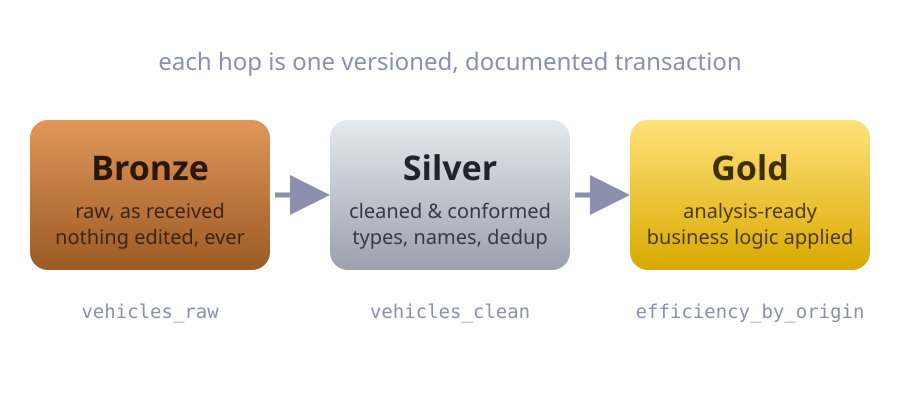

---
format:
  revealjs:
    theme: custom.scss
    width: 1280
    height: 720
    margin: 0.08
    transition: fade
    transition-speed: fast
    highlight-style: dracula
    slide-number: c/t
    hash: true
    menu: false
    code-line-numbers: false
    fig-align: center
    include-after-body: fitview.html
execute:
  echo: true
  warning: false
  message: false
---

```{r}
#| include: false
library(ducklake)
library(dplyr)
library(dplyneage)

# fresh lake every render so snapshot numbers on slides stay true
unlink("data/lake", recursive = TRUE)
dir.create("data/lake", recursive = TRUE, showWarnings = FALSE)

df_vehicles <- mtcars |>
  tibble::rownames_to_column("model") |>
  tibble::as_tibble()

df_origins <- tibble::tibble(
  model = df_vehicles$model,
  origin = rep(c("USA", "Japan", "Europe"), length.out = nrow(df_vehicles))
)

# colors mirror custom.scss so ggplot output sits flush on the slide background
theme_bttf <- ggplot2::theme(
  text = ggplot2::element_text(color = "#e8eaf2", size = 16),
  plot.title = ggplot2::element_text(color = "#e8eaf2", face = "bold", size = 18),
  plot.subtitle = ggplot2::element_text(color = "#8a90ad", size = 13),
  axis.text = ggplot2::element_text(color = "#8a90ad", size = 12),
  axis.title = ggplot2::element_text(color = "#8a90ad", size = 13),
  legend.title = ggplot2::element_text(color = "#e8eaf2"),
  legend.text = ggplot2::element_text(color = "#c0c5ce"),
  panel.grid.major = ggplot2::element_line(color = "#262b47"),
  panel.grid.minor = ggplot2::element_blank(),
  plot.background = ggplot2::element_rect(fill = "#0d0f1e", color = NA),
  panel.background = ggplot2::element_rect(fill = "#0d0f1e", color = NA),
  legend.background = ggplot2::element_rect(fill = "#0d0f1e", color = NA),
  legend.key = ggplot2::element_rect(fill = "#0d0f1e", color = NA)
)
```

## {.center background-color="#0d0f1e"}

::: {style="text-align: center;"}


[Quack to the Future]{.bttf-wordmark}

<div class="fire-trails"></div>

[Building traceable data lakehouses with DuckLake in R, <span style="color: #8a90ad;">on a laptop</span>]{style="font-size: .75em; color: #c0c5ce;"}

<br/>

<div class="time-circuits" style="font-size: .55em;">
<div class="tc-row tc-dest"><span class="tc-label">Destination</span><span class="tc-value">POSIT::CONF 2026 · HOUSTON TX</span></div>
<div class="tc-row tc-pres"><span class="tc-label">Presenter</span><span class="tc-value">TRAVIS GERKE · PCCTC</span></div>
<div class="tc-row tc-last"><span class="tc-label">Last time departed</span><span class="tc-value">FINAL_v2_FINAL.CSV · 1985</span></div>
</div>
:::

::: notes
"Hi, I'm Travis. I lead applied intelligence at the Prostate Cancer Clinical Trials Consortium, and this talk is about time travel for your data." Ironically, although this session is called from laptop to cluster, I'm going to describe a lake house approach which in many cases can enable the reverse: going from cluster to laptop. Two numbers if it comes up in Q&A: the median scan in Redshift and Snowflake reads about 100 MB and the 99.9th percentile reads under 300 GB, and the cheapest MacBook Apple sells finished all of ClickBench cold in under a minute, up to 2.8 times faster than the cloud instances it was measured against. Full number bank is on the lakehouse slide.
:::

# The problem {.divider visibility="hidden"}

## Unversioned data fades {.center}

::: {.columns style="align-items: center;"}
::: {.column style="width: 50%;"}
<div class="terminal" style="font-size: .6em;">
<div class="term-bar"><span class="dot r"></span><span class="dot y"></span><span class="dot g"></span> ~/projects/q3-report/data</div>
<div class="term-body">
analysis_data.csv<br/>
analysis_data_v2.csv<br/>
analysis_data_v2_<span class="hl">FINAL</span>.csv<br/>
analysis_data_v2_FINAL_<span class="hl">fixed</span>.csv<br/>
analysis_data_v2_FINAL_fixed_<span class="hl">USE_THIS_ONE</span>.csv<br/>
<span class="dim">analysis_data_old_DO_NOT_USE.csv</span><br/>
<span class="dim">temp.csv</span>
</div>
</div>
:::

::: {.column style="width: 50%; text-align: center;"}
<div class="polaroid">

</div>
:::
:::

::: {.auto-fade-in style="text-align: center; margin-top: .4em;"}
"Hey, this number **changed** since the last version. What happened?"

[You have absolutely no idea. Somewhere in the past, the timeline **skewed**.]{.quiet}
:::

::: notes
This data setup may look familiar to many of you: filenames are our version control, Slack is our audit log, memory is our lineage system. Every overwrite of an existing file is Marty's siblings disappearing, and what the data looked like, who changed it, and why quietly erase. The question is Marty's alternate 1985: someone changed your data upstream, and you can't see where the timeline forked; pays off at the change-feed and almanac slides.
:::

## We solved this once, for code {.center}

::: {.columns style="font-size: .9em;"}
::: {.column style="width: 50%;"}
For **code**, versioning is a reflex:

- every change is a commit: author, message, diff
- any past state is one checkout away
- "who changed this, and why?" is `git blame`
:::

::: {.column style="width: 50%;"}
For **data**, we do our best:

- dated folders, `_v2` suffixes
- careful names, good intentions
- but no author or diff, no way back
:::
:::

::: {.fragment .statement style="text-align: center; margin-top: .5em; font-size: 1.05em;"}
**Git-grade history** for your data, *without leaving R*.
:::

::: notes
Data pipelines need a paper trail, what changed, who changed it, why, and where every column came from. 
:::

## The lakehouse, in one slide

- Your tables live as **open files**, almost always Parquet (cheap, columnar)
- A **catalog** tracks which files make up each table, at each version
- Writes are **transactions**: atomic, versioned, never in a half-state
- This is what Iceberg and Delta Lake do for the Spark world

::: {.fragment style="text-align: center; margin-top: .6em;"}
::: columns
::: {.column width="55%"}
{width="420"}
:::
::: {.column style="width: 45%; text-align: left;"}
The catch: built for Spark clusters, run by platform teams.

**You don't need 1.21 gigawatts for this.**
:::
:::
:::

::: notes
If pressed on the bullets: the file format is technically pluggable (Iceberg also takes ORC and Avro) but Parquet is the near-universal choice, and every flavor has a catalog in function if not in name. Delta keeps a transaction log beside the data, Iceberg uses metadata files plus a catalog service, and DuckLake uses a plain SQL database, which is the punchline two slides ahead. "Spark clusters" stands in for the JVM stack nobody in this room runs. The laptop line lives on the title slide now, so don't say it again here; DuckDB reaches for a cluster only when the data outgrows one machine.

If pressed on scale. The Iceberg catalog tier alone: Apache Polaris ships production Helm values of 4 CPU and 8 GiB per pod at three replicas, plus its own Postgres, and the in-memory default is documented as unfit for production. The older Hive Metastore path is no lighter, with Cloudera calling the 256 MB default heap inadequate, HiveServer2 starting at 4 GB, and a 16 GB cap per instance because garbage collection pauses get long. A Spark or Trino cluster sits on top of that. The read path costs you too: three layers of metadata files read in sequence at roughly 100 ms a request, so half a second passes before you know which Parquet files to open. DuckLake asks one SQL question and gets one answer in milliseconds. Writes go the same way, about one transaction per second for Iceberg and Delta against roughly 100 for DuckLake, and Postgres alone sustains thousands. Every Iceberg insert also lands three or four files, which is how small-file cleanup becomes someone's job. On whether one machine holds: the cheapest MacBook, 8 GB of RAM with DuckDB capped at 5, ran all of ClickBench cold in 59.7 seconds, up to 2.8 times faster than the cloud instances it was measured against, and hot it came within 13 percent of a 16-vCPU box with four times the memory. TPC-DS SF100 on that same laptop: 1.63 second median, 15.5 minutes for the suite. A Galaxy S24 Ultra finished TPC-H SF100 over 30 GB in 235 seconds while an AWS r6id.large took 570.8. A 2012 MacBook Pro cleared all 22 TPC-H queries against a 265 GB database. Demand side: the median scan in Redshift and Snowflake reads about 100 MB, the 99.9th percentile under 300 GB.
:::

# Trip I: build the time&nbsp;machine {.divider .center background-gradient="radial-gradient(ellipse at 50% 120%, rgb(70 27 4), rgb(13 15 30) 62%)"}

<div class="time-circuits" style="font-size: .8em; margin-top: 1em;">
<div class="tc-row tc-dest"><span class="tc-label">Destination</span><span class="tc-value">A VERSIONED LAKE</span></div>
<div class="tc-row tc-pres"><span class="tc-label">Present time</span><span class="tc-value">library(ducklake)</span></div>
<div class="tc-row tc-last"><span class="tc-label">Last time departed</span><span class="tc-value">FLAT FILES · 1985</span></div>
</div>

::: {style="text-align: center; font-size: .9em; color: #c0c5ce; margin-top: 1em;"}
Three lines of R to a lake where every write is an **authored commit**.
:::

::: notes
Act break, chapter one: build the machine. Two quick intros (the engine, then the format), and the build itself is three lines. "{ducklake} is an R package that makes DuckLake feel native: dplyr in, versioned lake out."
:::

## You already have the engine

**DuckDB**: a full analytical database that lives *inside your R session*.

- `install.packages("duckdb")`: no server or cluster, no IT ticket
- Queries Parquet/CSV directly, scales past memory
- dbplyr speaks fluent DuckDB: your dplyr code *is* the SQL

::: {style="text-align: center;"}
[It's the DeLorean of databases: looks like a regular car, does something absurd when you floor it.]{.orange}
:::

::: notes
One-slide DuckDB primer for those who haven't touched it. The point to leave in their heads: it's already in R, and dplyr already drives it.

The DeLorean line, explained: the "regular car" part is the install — `install.packages("duckdb")`, runs in-process inside R, no server to stand up, nothing for IT to provision. Looks like any other R package. The "absurd when you floor it" part is the engine under the hood: a columnar, vectorized execution engine (processes data in batches of a few thousand values at a time instead of row-by-row), morsel-driven parallelism across cores, and an out-of-core design that spills to disk so it can scan data larger than RAM without falling over. That combination is why a single laptop clears ClickBench and TPC-H/TPC-DS benchmarks that were built assuming a cluster — the numbers cited two slides back (59.7s cold ClickBench on an 8GB MacBook, 235s TPC-H SF100 on a Galaxy S24 Ultra) are that same engine, just demonstrated at the extreme. Point being: nothing about the install suggests that capability is in there.
:::

## DuckLake: the lakehouse, minus the ceremony

::: columns
::: {.column width="50%"}
A DuckDB extension where the **entire lakehouse** is:

1. Parquet files in a folder (or S3)
2. A plain SQL database as the catalog (DuckDB, SQLite, or Postgres)

[Same pattern as Iceberg and Delta, minus the cluster and the platform team.]{.quiet}
:::

::: {.column width="50%"}
<div class="terminal" style="font-size: .6em;">
<div class="term-bar"><span class="dot r"></span><span class="dot y"></span><span class="dot g"></span> your entire lakehouse</div>
<div class="term-body">
data/lake/<br/>
├── quack_lake.ducklake &nbsp;<span class="dim"># catalog</span><br/>
└── main/<br/>
&nbsp;&nbsp;&nbsp;&nbsp;├── vehicles_raw/&ast;.parquet<br/>
&nbsp;&nbsp;&nbsp;&nbsp;├── vehicles_clean/&ast;.parquet<br/>
&nbsp;&nbsp;&nbsp;&nbsp;└── efficiency_by_origin/&ast;.parquet
</div>
</div>
:::
:::

::: notes
The "aha" for skeptics: you can `ls` your lakehouse. Files you can see, a catalog you can query. Everything the fancy formats promise, at a scale one person can own. This is my vehicle for the talk; the pattern is the point, and this is the version of it that fits in a folder.
:::

## Three lines to a lakehouse

```{r}
#| output: false
library(ducklake)

install_ducklake()   # once: grabs the DuckDB extension
attach_ducklake("quack_lake", lake_path = "data/lake")
```

<br/>

That's a working data lake in a folder. Every write is transactional and versioned.

::: notes
This executes for real at render. Emphasize the on-ramp: if they remember one code slide, it's this one.
:::

## The plan: a medallion pipeline

{width="900" fig-align="center"}

::: {.quiet style="text-align: center;"}
Fancy name, honest idea: keep raw data sacred, refine in stages, analyze from gold.
:::

::: notes
Medallion in 20 seconds: it's just staged refinement with rules. The demo follows these three hops.
:::

## Bronze: every write is a commit

```{r}
#| output: false
with_transaction({
  create_table(df_vehicles, "vehicles_raw")
  create_table(df_origins,  "origins_raw")
},
  author         = "marty",
  commit_message = "Load raw vehicle + origin data"
)
```

<br/>

- The write is **atomic**: both tables or neither
- It's recorded with an **author** and a **commit message**

::: notes
The signature ducklake API move: the transaction wrapper is where who-and-why get recorded. Every write from here on has a name attached.
:::

## Silver and gold: it's just dplyr

```{r}
#| output: false
with_transaction(
  get_ducklake_table("vehicles_raw") |>
    mutate(cyl = as.integer(cyl), heavy = wt > 3.5) |>
    select(model, mpg, cyl, wt, heavy) |>
    create_table("vehicles_clean"),
  author = "doc", commit_message = "Clean + standardize vehicles")

with_transaction(
  get_ducklake_table("vehicles_clean") |>
    left_join(get_ducklake_table("origins_raw"), by = "model") |>
    group_by(origin) |>
    summarise(avg_mpg = mean(mpg, na.rm = TRUE), n_models = n()) |>
    create_table("efficiency_by_origin"),
  author = "doc", commit_message = "Gold: efficiency by origin")
```

`get_ducklake_table()` returns a **lazy dbplyr table**: DuckDB does the work, nothing is collected until you ask.

::: notes
No new verbs to learn: mutate, join, summarise. The only additions are the bookends: get table, create table, wrapped in a documented transaction.
:::

## Your data has a git log now

```{r}
list_table_snapshots() |>
  select(snapshot_id, author, commit_message)
```

<br/>

::: {.statement style="font-size: 1em;"}
Six months from now, *"why did this change?"* has an **answer you can query**.
:::

::: notes
Pause and let them read; this output is real, generated when the deck rendered. This is the audit trail slide, and the button on chapter one: the lake exists and it remembers. Chapter two is what the remembering buys you.
:::

# Trip II: drive the time&nbsp;machine {.divider .center background-gradient="radial-gradient(ellipse at 50% 120%, rgb(70 27 4), rgb(13 15 30) 62%)"}

::: {style="text-align: center; font-size: .9em; color: #c0c5ce; margin-top: 1em;"}
The lake remembers everything: query the past, see **exactly what changed**, undo&nbsp;mistakes.
:::

::: notes
Act break, chapter two: use the machine. Reading history, surviving Biff, and fixing the timeline without erasing anyone from the log.
:::

## Time travel {.center}

```{r}
get_ducklake_table_version("vehicles_clean", version = 2) |>
  head(3) |>
  collect()
```

<div class="time-circuits" style="font-size: .5em; margin-top: .8em;">
<div class="tc-row tc-dest"><span class="tc-label">Destination</span><span class="tc-value">SNAPSHOT 02 · vehicles_clean</span></div>
<div class="tc-row tc-pres"><span class="tc-label">Present time</span><span class="tc-value">SNAPSHOT 03</span></div>
<div class="tc-row tc-last"><span class="tc-label">Last time departed</span><span class="tc-value">AUTHOR: doc</span></div>
</div>

::: notes
Query any table exactly as it existed at any snapshot, or any timestamp with `get_ducklake_table_asof()`. No backup archaeology, no restore drills.
:::

## Then Biff gets write access

```{r}
#| output: false
with_transaction(
  get_ducklake_table("vehicles_clean") |>
    rows_delete(
      get_ducklake_table("vehicles_clean") |> filter(mpg < 25),   # "cleanup"
      by = "model"),
  author = "biff", commit_message = "small tweak")
```

```{r}
get_ducklake_table("vehicles_clean") |> tally() |> collect()
```

32 rows → 6 rows, on a Friday afternoon, labeled **"small tweak."**

::: notes
Every team has a Biff. Sometimes Biff is you, at 4:47 PM. You can't prevent the mistake; you can make it visible, attributed, and reversible.
:::

## "What happened?" is now a query

```{r}
get_table_changes("vehicles_clean", start = 4, end = 4) |>
  select(change_type, model, mpg) |>
  head(3) |>
  collect()
```

```{r}
#| include: false
n_biff_deleted <- get_table_changes("vehicles_clean", start = 4, end = 4) |>
  filter(change_type == "delete") |> tally() |> collect() |> pull(n)
```

All `r n_biff_deleted` deleted rows, with the values they had **before** Biff touched them.

The question from the opening has an answer now: not a guess, the *rows*.

::: notes
The payoff of the changed-number question from the hook. DuckLake calls this the data change feed: every insert, delete, and update pre/post image between any two snapshots, as a lazy table you filter with dplyr. Delivery note for me: row-level ops (rows_delete, rows_update) are what the feed traces; a full replace_table is a drop-and-create, so its history starts over. That's why Biff's tweak is a rows_delete.
:::

## Fixing the timeline

```{r}
restore_table_version("vehicles_clean", version = 2)
get_ducklake_table("vehicles_clean") |> tally() |> collect()
```

Restore rolls **forward** as a *new* snapshot: Biff's mistake stays in the log.

You fix the timeline **without erasing anyone from the photo**.

::: notes
Callback to the Polaroid. Contrast with the flat-file world, where the fix is overwriting the overwrite and praying. History is append-only; even the recovery is auditable.
:::

## The other half of the paper trail

SQL teams already get **column-level lineage** from tools like dbt and SQLMesh:

> "`gold.avg_mpg` is computed from `vehicles_raw.mpg`, through these two models."

<br/>

For **dplyr pipelines**? Nothing. The lineage lives in your head,

and your head does not survive job changes.

::: notes
The turn into chapter three. Snapshots answer what changed, who, and why. The stem has one clause left: where every column came from. Names dbt/SQLMesh for the audience members who know them ("oh, it's THAT") and defines lineage for everyone else with one concrete example sentence.
:::

# Trip III: trace the flux&nbsp;capacitor {.divider .center background-gradient="radial-gradient(ellipse at 50% 120%, rgb(70 27 4), rgb(13 15 30) 62%)"}

::: columns
::: {.column width="45%"}
{width="380"}
:::
::: {.column style="width: 55%; text-align: left;"}
<br/><br/>
[{dplyneage}: column-level lineage for dplyr pipelines]{.cyan}

[Follow every column to its source, and know what breaks **before** you change the past.]{style="font-size: .85em; color: #c0c5ce;"}
:::
:::

::: notes
Act break, chapter three. ducklake answers when/who/why per table; dplyneage answers the finer question: where did this *column* come from. It's what makes lineage possible.
:::

## What "column-level lineage" means

For every column in your result, the exact trail back to its sources:

<br/>

```r
gold.avg_mpg
  └── mean(mpg, na.rm = TRUE)      # the transformation
        └── vehicles_clean.mpg     # the source column
              └── vehicles_raw.mpg # ...all the way down
```

<br/>

Table-level tools stop at "these tables are related." This goes further: **this cell traces to that column, via this expression.**

::: notes
Table-level lineage is common; column-level is the version that answers real questions during an audit or a debugging session.
:::

## One pipe away from a diagram

```{r}
#| output-location: slide
library(dplyneage)

get_ducklake_table("vehicles_clean") |>
  left_join(get_ducklake_table("origins_raw"), by = "model") |>
  group_by(origin) |>
  summarise(avg_mpg = mean(mpg, na.rm = TRUE), n_models = n()) |>
  extract_lineage() |>
  lineage_flow(height = "560px")
```

::: notes
The money demo. Take any dplyr pipeline you already have, pipe it into two more functions. Next slide is the live widget: drag a node, hover an edge to show the expression labels.
:::

## No plutonium required

How does it know?

- Your dplyr pipeline is already a **lazy query tree** (thanks, dbplyr)
- {dplyneage} walks that tree directly, in **pure R**, with exact attribution
- Joins, aggregations, windows, unions: resolved to true source columns
- Raw SQL strings? A sqlglot fallback handles those (Python optional)

<br/>

::: {.quiet style="text-align: center;"}
No parsing your SQL with regex, no YAML confessional. No Python required.
:::

::: notes
For the "what's the catch" people: dbplyr already built the query tree; dplyneage just finally reads it. That's why attribution is exact rather than best-effort string matching.

Likely Q&A: "does it work on plain data frames?" A local dplyr pipeline has no query tree to walk, so no. The one-line fix is dbplyr::memdb_frame() or copy_to(), and the identical pipeline becomes traceable; extract_lineage() errors with exactly that pointer as of 0.2.0.
:::

## Before you change the past…

```{r}
lin <- get_ducklake_table("vehicles_clean") |>
  left_join(get_ducklake_table("origins_raw"), by = "model") |>
  group_by(origin) |>
  summarise(avg_mpg = mean(mpg, na.rm = TRUE), n_models = n()) |>
  extract_lineage()

lineage_downstream(lin, "vehicles_clean.mpg")   # what would I break?
lineage_upstream(lin, "output.avg_mpg")         # where did this come from?
```

::: columns
::: {.column width="60%"}
Impact analysis as a function call: know what a change touches **before** you make it.
:::
::: {.column width="40%"}
{width="340"}
:::
:::

::: notes
The almanac lesson: changing upstream data without knowing the downstream consequences is how you get the bad 1985. Renaming a column? Ask lineage_downstream first.
:::

# Where we're going {.divider background-gradient="radial-gradient(ellipse at 50% 120%, rgb(70 27 4), rgb(13 15 30) 62%)"}

## The whole paper trail, assembled {.center}

|  | question | answer |
|---|---|---|
| {ducklake} | *when / who / why* did tables change? | every write is an authored, versioned commit |
| {dplyneage} | *where* did each column come from? | exact lineage from your dplyr code |

Strip away the duck and the recipe is small: an **open format**, a **catalog**, and writes that land as **commits**. DuckLake is the road I took; Iceberg and Delta go to the same place.

::: {.statement style="font-size: 1.05em; margin-top: .5em;"}
We made version control a habit for code. **Data's turn.**
:::

::: {.quiet style="text-align: center; margin-top: .7em; font-family: 'Fira Code', monospace;"}
`pak::pak("tgerke/ducklake-r")` · `pak::pak("tgerke/dplyneage")`<br/>github.com/tgerke/quack-to-the-future
:::

::: notes
The whole close on one slide. Bring the stem back: what changed, who, why is ducklake; where every column came from is dplyneage. They compose because both are lazy tables: query a past snapshot, extract lineage on it, same DAG (full demo in backup). Then the big idea without the branding: this community made code versioning a norm, and the ask is to extend that norm to data. If someone walks out and reaches for Iceberg instead of DuckLake, the talk still worked. CTA stays Monday-sized: take one pipeline you already own and put its tables in a lake with authored commits. Thirty minutes, reversible. Maturity if asked: experimental lifecycle badges on both; ducklake's CRAN submission in review, v0.4.1 archived on Zenodo with a DOI; dplyneage 0.2.0 tagged on GitHub; docs at tgerke.github.io/ducklake-r and tgerke.github.io/dplyneage. Spoken sign-off over this slide, slow and sincere: your data's future is whatever you make it, so make it a good one. Thank you, and drive safely.
:::

# Backup {.divider visibility="uncounted"}

## Lineage across the whole lake {visibility="uncounted"}

```{r}
#| output: false
silver <- get_ducklake_table("vehicles_raw") |>
  mutate(cyl = as.integer(cyl), heavy = wt > 3.5) |>
  select(model, mpg, cyl, wt, heavy)

gold <- get_ducklake_table("vehicles_clean") |>
  left_join(get_ducklake_table("origins_raw"), by = "model") |>
  group_by(origin) |>
  summarise(avg_mpg = mean(mpg, na.rm = TRUE), n_models = n())

lin_lake <- extract_lineage(
  list(vehicles_clean = silver, efficiency_by_origin = gold))
```

::: notes
Name your models in a list and the layers stitch: bronze through gold in one DAG. This is the dbt docs page experience, generated from the dplyr you already wrote.
:::

## {visibility="uncounted"}

```{r}
#| echo: false
lineage_flow(lin_lake, height = "560px")
```

## And it travels beyond R {visibility="uncounted"}

```{r}
#| eval: false
lineage_mermaid(lin)       # Mermaid text: renders on GitHub, in Quarto docs
lineage_openlineage(lin)   # OpenLineage JSON: DataHub, Marquez, OpenMetadata
lineage_diff(old, new)     # CI check: "this PR rewires gold.avg_mpg"
```

<br/>

Lineage you can treat as **data**:

document it, catalog it, gate pull requests on it.

::: notes
For the data engineers in the room: this speaks the standards their platform tools already ingest. R stops being the opaque box in the org's lineage graph.
:::

## Lineage × time travel {visibility="uncounted"}

Lineage is a property of your **code**; snapshots are a property of your **data**.

```{r}
#| eval: false
get_ducklake_table_version("vehicles_clean", version = 2) |>
  summarise(avg_mpg = mean(mpg)) |>
  extract_lineage()   # same DAG as today
```

<br/>

The audit question this answers: "for the June submission, what fed this estimate, in the data as of June?" Both packages, four lines.

::: notes
Kept for Q&A. Time travel changes what the data was, never where it came from, so a past snapshot yields the same DAG as today for the same code.
:::

## The same question, without a time machine {.center visibility="uncounted"}

**Duke, 2006.** A genomic predictor promised to match each cancer patient to the chemotherapy most likely to work.

When MD Anderson biostatisticians Keith Baggerly and Kevin Coombes tried to verify it, the forensic work ran to about **1,500 hours**. What they found: sensitive/resistant labels reversed, gene lists shifted off by one row.

Three clinical trials ran on it before Duke shut them down. Ten papers retracted.

::: {.statement style="font-size: 1em; margin-top: .6em;"}
That is the price of a missing paper trail.
:::

::: {.quiet style="text-align: center; margin-top: .6em;"}
Baggerly & Coombes (2009), *Annals of Applied Statistics*. Their data and code: still public, still reproducible.
:::

::: notes
One serious beat, and the only slide in the deck with nothing funny on it; part of the room knows this case, so let the recognition land. Timeline if asked: Potti and Nevins published the predictors starting 2006 in Nature Medicine; MD Anderson clinicians asked Baggerly and Coombes to vet them before adopting; the reconstruction became the 2009 Annals of Applied Statistics paper; Duke's three trials were suspended, restarted, then terminated in November 2010 as the scandal broke and Potti resigned; Retraction Watch counts ten retractions plus seven corrections, and the federal Office of Research Integrity found misconduct in 2015. The honest claim, and the reason the slide sits right after the change-feed demo: versioning would not have caught the errors by itself. It makes the reconstruction cheap. The change feed shows what changed between versions, lineage narrows where to look, and the 1,500 hours become queries; detection stays human. Their full supplement (raw data, R code, reports) is still served by bioinformatics.mdanderson.org, which is what would make a replay of this case possible.
:::

## Freeze a moment forever {visibility="uncounted"}

```{r}
#| eval: false
# a read-only lake, pinned to the snapshot you reported from
attach_ducklake("q3_submission", lake_path = "data/lake",
                snapshot_version = 3, read_only = TRUE)
```

::: columns
::: {.column width="55%"}
```{r}
#| echo: false
#| fig-height: 4.2
plot_snapshots() + theme_bttf
```
:::
::: {.column width="45%"}
{width="380"}

::: {.quiet}
In my world of prostate cancer clinical trials, "trust me" is not an audit trail. *This* is what a regulator can read.
:::
:::
:::

::: notes
The clinical cameo, ~20 seconds: at PCCTC, datasets back regulatory decisions. A pinned, read-only snapshot is the difference between "we believe this is the data we used" and pointing at the commit. The clock stopped at 10:04, and you can prove it.
:::
